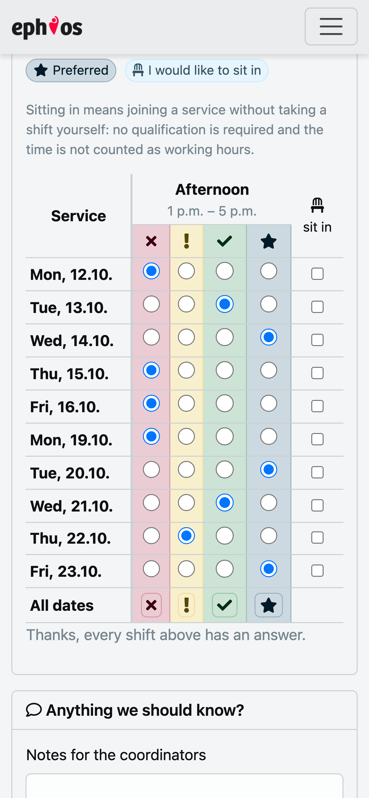
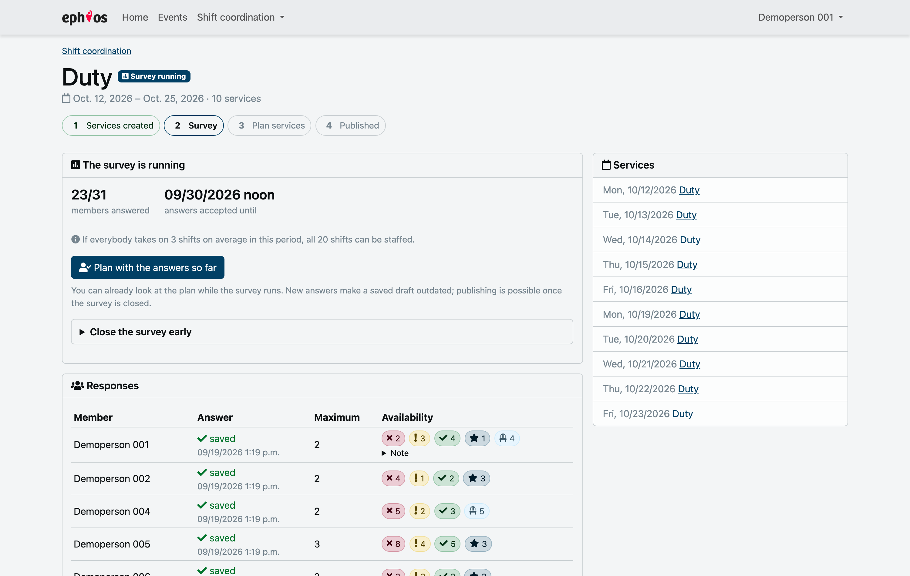
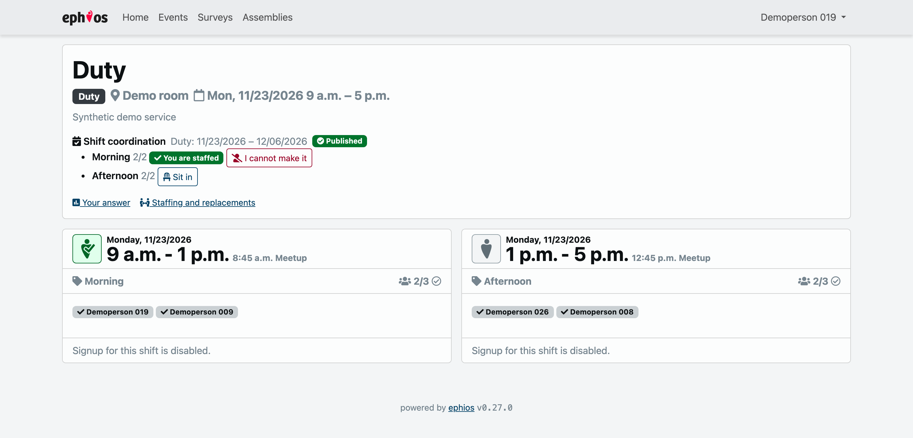

# Feature tour

Screenshots from the development stack with its synthetic demo data.

## Members answer on their phone

One row per service, one column group per shift they may take, four choices and an optional
offer to sit in. The bottom row sets a whole column at once, and the footer says what is still
open.

## The answers arrive

The period page counts who answered, names the recommended personal maximum and says plainly
whether the shifts can be filled with it. Planning can start before the deadline; closing the
survey early takes one confirmation.

## Plan

The whole period on one page, only the weekdays that carry shifts, everybody's remaining
capacity in the sidebar. **Calculate proposal** fills as many shifts as the rules allow and
marks how each person rated the shift they got: preferred, available, if needed, or sitting in.
What nobody can cover stays visibly empty.

## Check and publish

Publication takes the saved shared draft and nothing else. It creates confirmed ephios
participations and sends one summary per person; shifts below their minimum have to be
confirmed first.

## Staff and replace

After publication every service shows who answered they are available that day, whether they
could take the shift and what speaks against it.

Members do not need that page for the usual case: the service itself carries their own state
and the way out of it.

