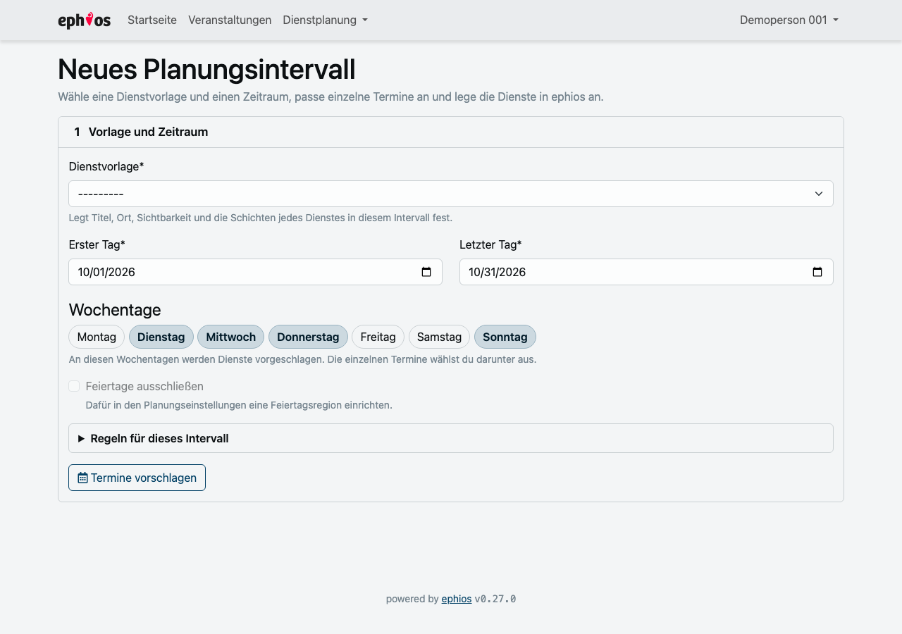
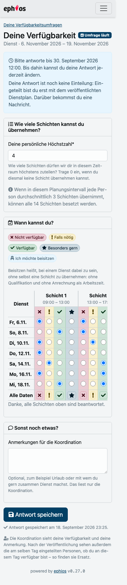
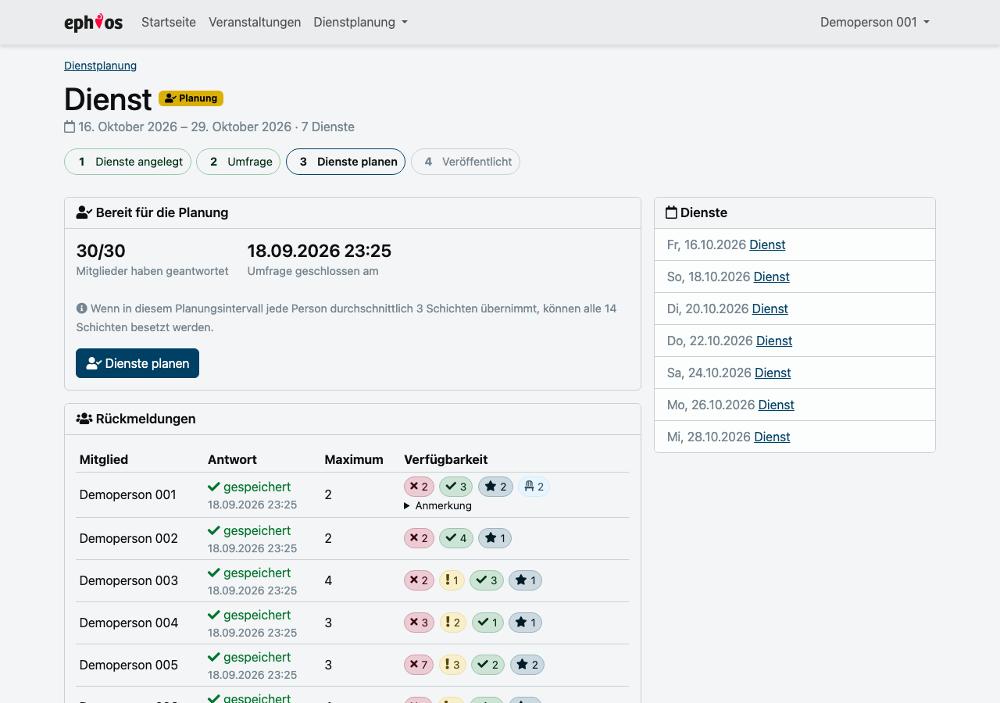
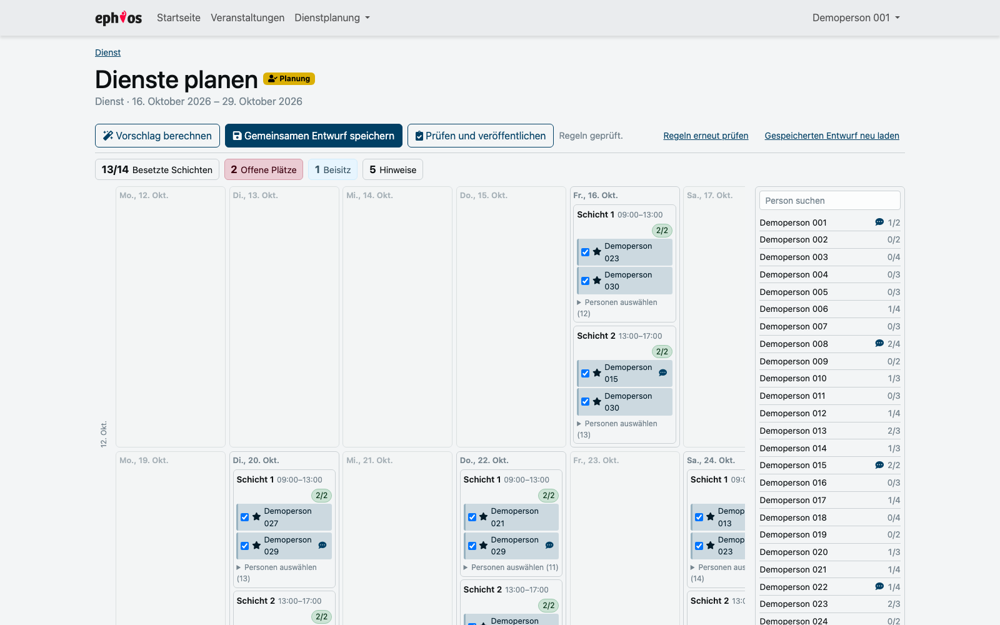
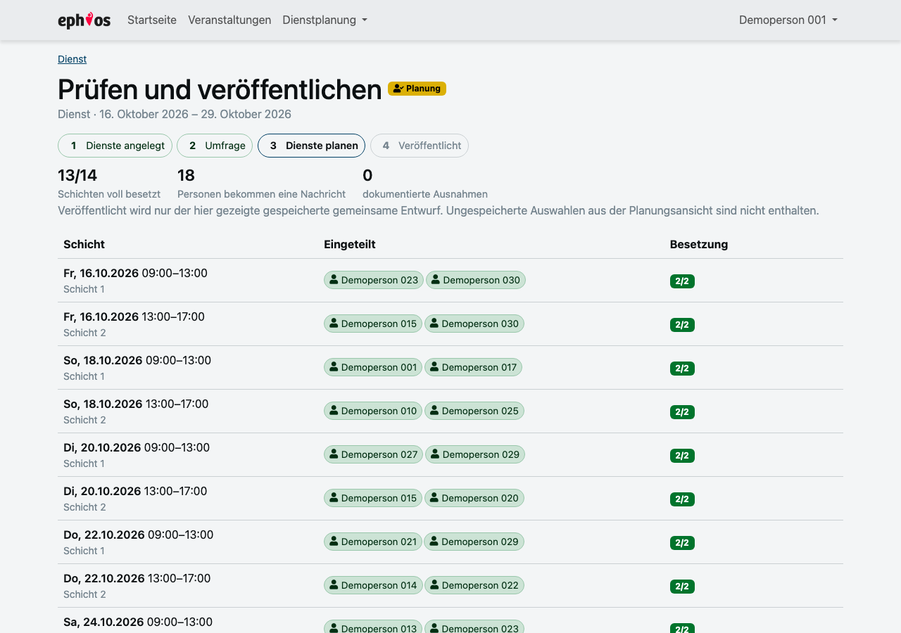
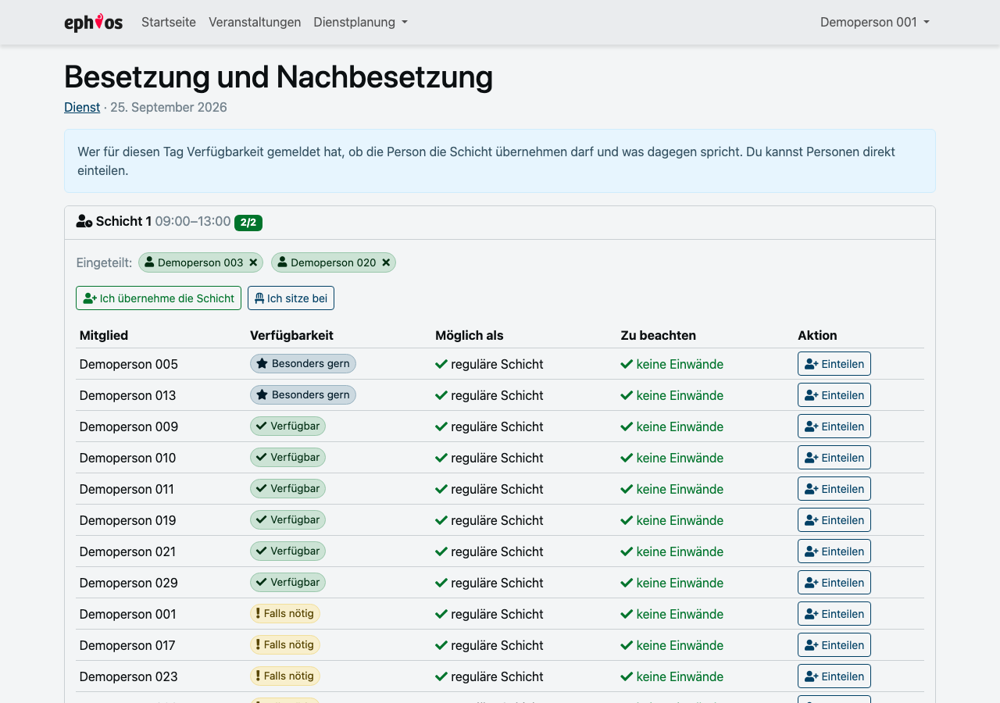
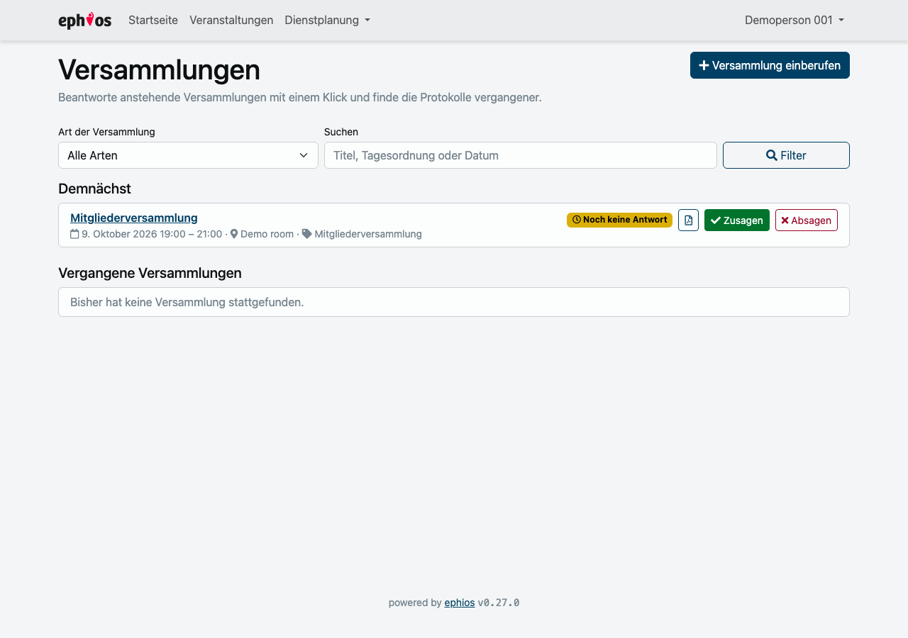
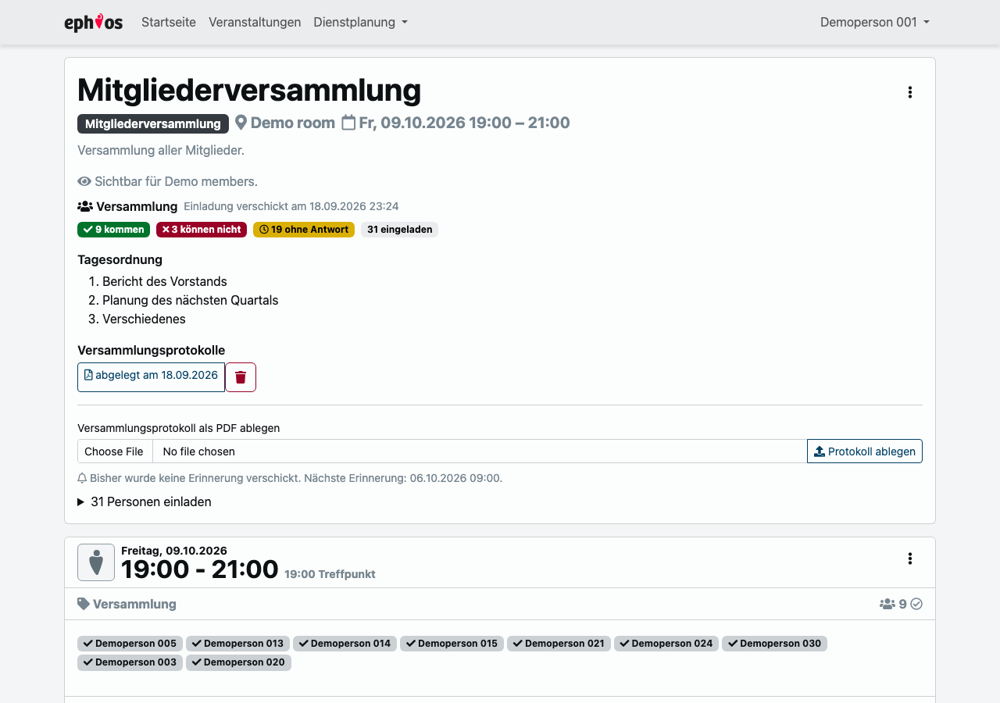
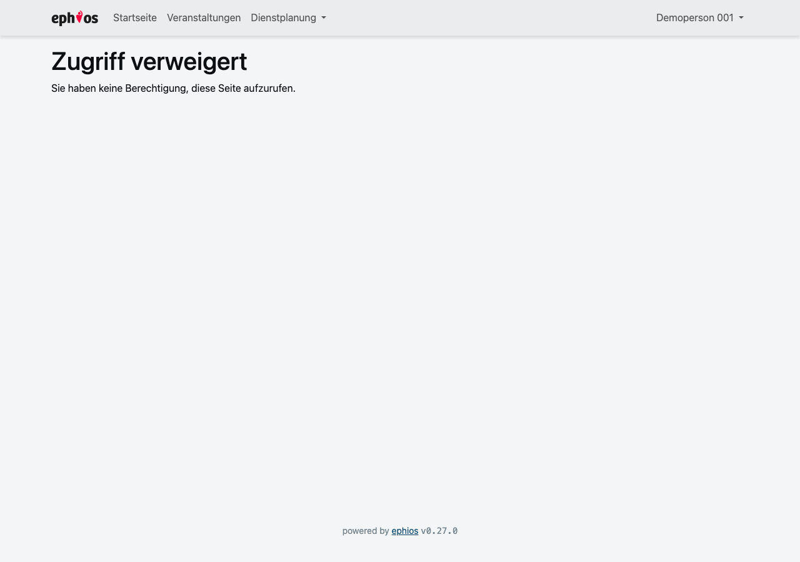

# Feature tour

Screenshots from the development stack with its synthetic demo data.

## Create a planning period

Pick a service template and a date range, tick the days, and every selected date becomes one
ephios event with the template's shifts. The last step offers a reminder for planning the
period after this one.

## Run the survey

Members answer in one table: a rating per shift, a personal maximum, and a private note for
the coordinators. It is built for the phone, because that is where most people answer.

## Watch the answers come in

The period page shows who answered, the recommended personal maximum and what is still
missing, and it is the place to close the survey early.

## Plan

The whole period on one page, only the weekdays that carry shifts, everybody's remaining
capacity in the sidebar. **Vorschlag berechnen** fills as many shifts as the rules allow; the
counters and the rule checks update as you edit.

## Check and publish

Publication takes the saved shared draft, nothing else. It creates confirmed ephios
participations and sends one summary per person.

## Staff and replace

After publication every service links to its staffing: who answered they are available that
day, whether they could take the shift, and what speaks against it.

## Assemblies

Upcoming and past assemblies on one page, filtered by kind and searched by title, agenda or
date. Accept or decline straight from the list, and open the minutes of a past one.

## An assembly

The agenda, who is coming, who is not, who has not answered yet, the reminder schedule, and
the place to file the minutes.

## Settings

One page for the values every new planning period starts from, the reminder rules and the
public duty information.

